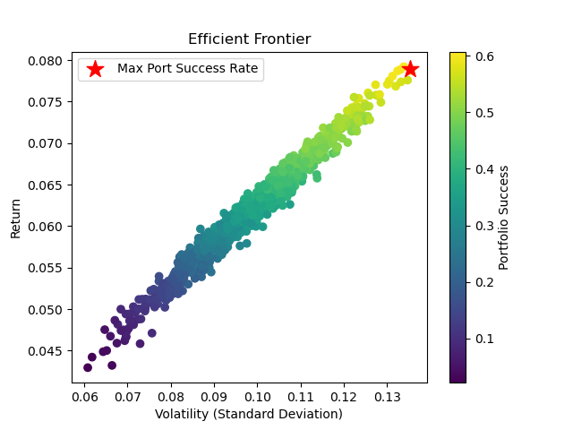
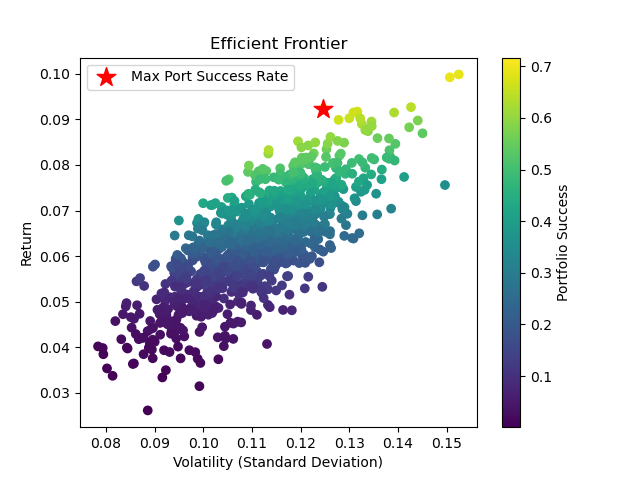

# MFM Winter Workshop: Project 1
*[CAUTION: The files called test_allocation should only be run from the notebook directory since they require relative paths]*


You can check the notebook folder for some intial tests.


# Quick Start
## Unix (Linux/MacOS)
```shell
git clone git@github.com/dominiccook/reto && cd reto
```
```shell
python src/databento/Modern_Portfolio_Success_Rate_MFM_Workshop.py
```

## Windows
#### Command Prompt/CMD
```cmd
git clone git@github.com:dominiccook/reto.git & cd reto
```
```cmd
python src\databento\Modern_Portfolio_Success_Rate_MFM_Workshop.py
```
#### Powershell
```powershell
git clone git@github.com:dominiccook/reto.git; cd reto
```
```powershell
python src\databento\Modern_Portfolio_Success_Rate_MFM_Workshop.py
```

# Installation
Run the following to install package:
```shell
pip install project1
```
## Available Imports 
It will be helpful to have the package for importing the methods into a jupyter notebook, since jupyter notebooks provide lots of functionality that it helpful when exploring the code, and testing different parameters. 
(NOTE: More parametrization is needed to make the package more portable, and improve its usability in a jupyter notebook.)
*(NOTE: These _will_ change, but I will try to keep the README up-to-date.)*
```python
# main.py consists of the functions used
#+to wrangle the return data and calculate
#+the metrics entered into the other modules.
import main

# The following two modules contain the scripts
#+that do the actual simulating.
# Uses metrics calculated from databento returns.
import Modern_Portfolio_Success_Rate

# Uses metrics provided by mentor's initial
#+portfolio.
import mentor
```

# Running
### Parameters and Data Processing
Running the main source file will print logs that show the data I've used from databento, and the calculations I'm doing to find the parameters I'm putting in our mentor's script.

The return data is NOT included in this repository. If you would like to run this with actual return data, the main.py file assumes OHLCV schema for hourly returns. However, the necessary return metrics and correlations are included as CSV files in this repository and can be found in the data subdirectory.

```shell
python src/main.py
```


### Simulation
Running these Portfolio Success Rate scripts will simulate future portfolio successes, either with the Original parameters provided by our mentor, or with the parameters calculated by our script.

```shell
python src/mentor/Modern_Portfolio_Success_Rate_MFM_Workshop.py
```

 


```shell
python src/databento/Modern_Portfolio_Success_Rate_MFM_Workshop.py
``` 
 


# TODO
- Increase portability of the code.
- Come up with ways of improving our model.
